<!--
  ═══════════════════════════════════════════════════════════════════════
  GitHub Profile README · Jayant Katariya
  -----------------------------------------------------------------------
  Filled from profile.json: JayxCodemax · Jayant Katariya · batch 2025-29.
  Change anything there, then: python3 tools/personalize.py  (rewrites + validates).
  Regenerate the small bars:  python3 tools/gen_mini_bars.py
  Rebuild the local preview:  python3 tools/build_preview.py
  ═══════════════════════════════════════════════════════════════════════
-->

<p align="center">
  
</p>

<h1 align="center">👋 Hi, I'm Jayant Katariya</h1>

<p align="center">
  ⚡ <b>Electrical Engineering · B.Tech 2025-29</b> · Arya College of Engineering , Jaipur <sub>(RTU Kota)</sub><br/>
  Learning to bridge <b>hardware circuits</b> and <b>intelligent software control</b> — one breadboard, one commit at a time.<br/>
  <b>Open for working on projects</b> — collaborators welcome, I document as I build.
</p>

<p align="center">
  
  <a href="mailto:katariyajayant95@gmail.com"></a>
  <a href="https://github.com/JayxCodemax"></a>
  
</p>

<p align="center">
  <sub>⏳ self-updating counters (one workflow, zero manual maths — swap the username and they go live):</sub><br/>
  
  
  
</p>

<p align="center">
  &nbsp;
  &nbsp;
  <a href="https://github.com/JayxCodemax?tab=repositories"></a>&nbsp;
  &nbsp;
  <a href="https://github.com/kittinan/spotify-github-profile"></a>
</p>

---

<!-- TO SWITCH ON ▸ Spotify "currently playing" card.
     1. Sign in once at https://github.com/kittinan/spotify-github-profile (authorises the free endpoint).
     2. Delete the two wrapper marker lines around the <a> tag below (the HTML comment opener just above,
        and its closer on the line after the tag). It caches an "expired" state until the token refreshes,
        so only switch it on after step 1.
<a href="https://github.com/kittinan/spotify-github-profile"></a>
-->

## 🔭 What I Do &amp; What I'm Learning

<table align="center" cellpadding="0" cellspacing="0">
<tr>
<td width="52%" valign="top">

- ⚡ **Core focus** — exploring **embedded systems**, **robotics** and **automation**.
- 🛠️ **CAD &amp; hardware design** — working with **2D CAD**, and learning **AutoCAD Electrical**, **LTspice** and **Simulink**.
- 🤖 **Microcontrollers** — programming &amp; prototyping using **Arduino IDE** and **Python**.
- 🌐 **Software &amp; web** — occasional **frontend web development** projects and hands-on *"vibe coding"*.
- 🎯 **Current goal** — **bridging hardware circuits with intelligent software control systems**: a clean schematic, firmware that behaves, and a web UI that shows it working.

<br/>

```cpp
// where I am, honestly
void setup() {
  Serial.begin(115200);
  fundamentals = LEARNING;     // circuits, signals, control
  curiosity    = ALWAYS_ON;
  imposter_syndrome--;         // decrements with every fixed bug
}

void loop() {
  watchTutorial(); simulate(); build();
  breakSomething(); document();
  // first repos are coming — this profile is the day-1 version
}
```

</td>
<td width="48%" valign="top" align="center">


<br/><sub>the animated `sketch.ino` that "compiles" on every page load</sub>

</td>
</tr>
</table>

---

## 🛠️ Tech &amp; Tools

<details open>
<summary><b>🧑‍💻 Languages</b></summary>
<p align="center">
  
  
  
  
  
  
</p>
</details>

<details open>
<summary><b>⚡ Circuit Design &amp; Simulation</b></summary>
<p align="center">
  
  
  
  
  
  
  
</p>
</details>

<details open>
<summary><b>🤖 Hardware &amp; Prototyping</b></summary>
<p align="center">
  
  
  
  
  
  
  
</p>
</details>

<details open>
<summary><b>🌐 Web &amp; Utilities</b></summary>
<p align="center">
  
  
  
  
  
  
  
</p>
</details>

<sub>🌱 *Anything marked "learning", "basics" or "wishlist" above is exactly that — no inflated expertise here. The bars below show where I actually stand.*</sub>

---

## 📈 Where My Skills Actually Are

Bars are **self-assessed learning stages**, not industry levels — and they re-animate on every visit.

<p align="center">
  
</p>

<p align="center">
  &nbsp;
  &nbsp;
  
</p>
<p align="center">
  &nbsp;
  &nbsp;
  
</p>
<p align="center">
  &nbsp;
  &nbsp;
  <a href="tools/gen_mini_bars.py"></a>
</p>

> **The plan is simple:** 

---

## 🚀 Featured Projects

<table align="center">
<tr>
<td width="50%" valign="top">

#### 🟡 `01` — Weather / Room Monitor
**Arduino + DHT11 + OLED** · *on the bench*

Sensors → serial → an HTML dashboard I build myself. The "hello world" that actually teaches wiring, timing and debugging.

<sub>📅 status: **started — first push this semester**</sub>

</td>
<td width="50%" valign="top">

#### 🟡 `02` — Line-Follower Robot
**Arduino Nano + IR array + PID** · *planned*

Closed loop, not open-loop luck. Motor driver wiring, tuning runs, and a printed mount from the college 3D printer.

<sub>📅 first push expected: **next break**</sub>

</td>
</tr>
<tr>
<td width="50%" valign="top">

#### 🟡 `03` — LTspice Workbook
**RC / RL / filters / PSU** · *building it now*

One `.asc` per concept: simulate, hand-calculate, compare, write down where they disagree.

<sub>📅 folder growing privately → public once it has 10 sims</sub>

</td>
<td width="50%" valign="top">

#### 🟡 `04` — AutoCAD Electrical Practice Drawings
**Wiring diagrams + panel layout** · *learning*

Re-drawing real motor-control circuits until symbols and numbering stop slowing me down.

<sub>📅 DWG → PDF → repo</sub>

</td>
</tr>
</table>

<p align="center">
  &nbsp;
  <a href="https://github.com/JayxCodemax?tab=repositories"></a>&nbsp;
  <a href="https://github.com/JayxCodemax?tab=repositories"></a>
</p>

<details>
<summary><b>🛠️ The first-repo checklist I'm following (steal it)</b></summary>
<br/>

- [ ] Create `JayxCodemax/weather-monitor` and push the sketch — even if it's just blinking with extra steps.
- [ ] Add a README with **what / how to wire / what broke**, plus one photo of the messy prototype.
- [ ] Commit 3× a week for 4 weeks. Small, boring commits beat dramatic disappearances.
- [ ] Turn one LTspice `.asc` into a mini tutorial with a screenshot of the waveform.
- [ ] Only then touch GitHub Pages: publish the dashboard so it's a clickable link, not a folder.
- [ ] Write the "what I'd do differently" section — that's the part people actually read.

<details>
<summary>Project-card template for when a repo exists (copy-paste)</summary>

```markdown
<table><tr>
<td width="38%">

#### 🤖 Line-Follower v2

- **What:** PID + 5-IR array, corner response 0.4 s
- **Hardware:** Arduino Nano, TB6612, 18650 pack
- **Learned:** encoder calibration beats guessing Kp
- **Links:** [code](https://github.com/JayxCodemax/…) · [build log](…) · [video](…)

</td><td width="62%" align="center">


</td></tr></table>
```

</details>
</details>

---

## 🌱 Skills I'm Adding Next 

> Ordered by *effort-to-reward ratio*. 

| Skill | Why it's an easy win | First project |
|---|---|---|
| **Tinkercad Circuits** | Zero install, drag-and-drop Arduino sim | Blink + LDR-triggered buzzer, in the browser |
| **Wokwi / Proteus sim** | Simulate before you buy hardware | Full line-follower with no soldering |
| **KiCad** | Free, industry-relevant, huge docs | Re-draw an Arduino shield as a 2-layer PCB |
| **Git &amp; GitHub (branch / PR)** | Stops "final_v3_FINAL.zip" syndrome | Move one sketch to a repo with a real README |
| **VS Code + C/C++ extension** | Linting, IntelliSense, code hints | Port an Arduino sketch into PlatformIO |
| **Python: pyserial + matplotlib** | Instant "PC talks to board" superpower | Plot live sensor data from the serial port |
| **LTspice: RC, filters, PSU** | The fastest way to trust a design | Simulate a rectifier + cap, compare by hand |
| **Simulink / MATLAB basics** | The language of control systems | Model a DC motor, tune a PID block |
| **Embedded C debugging** | `printf` → `SWD/JTAG` is a cheat code | Find a planted bug in someone's ISR |
| **Soldering + heat-shrink discipline** | Makes every prototype 10× more reliable | Build a perfboard badge of your initials |
| **3D printing (Tinkercad 3D / Blender)** | Prints enclosures &gt; masking tape | Print a phone stand, then a servo bracket |
| **Linux CLI &amp; SSH on a Pi** | Where real embedded work happens | Headless Pi serving a sensor page |
| **MQTT + web dashboard** | Hardware → cloud in ~40 lines | ESP32 room monitor with an HTML status page |
| **Datasheet reading** | The superpower no course teaches | Pull 5 real specs from a random IC datasheet |
| **LaTeX / Overleaf reports** | Lab records people can reuse | Typeset one lab file properly |

<details>
<summary><b>🧪 Stretch goals I've bookmarked (for when the basics get boring)</b></summary>
<br/>

**FreeRTOS tasks &amp; queues** · **state machines** for robot behaviour · **op-amp filtering** for noisy sensors · **switching vs linear regulators** · **PCB design rules &amp; EMC hygiene** · **CAN / Modbus** for industrial gear · **OpenCV + PID = a tracking turret** · **CI that compiles my firmware on every push** · **technical writing** — explain one bug well, publicly.

</details>

---

## 🗺️ The Roadmap

<table>
<tr>
<td width="25%" valign="top">

#### 🌱 Phase 1 · Foundations
- [x] Blink, PWM, ADC
- [x] Sensors &amp; libraries
- [x] 2D CAD basics
- [ ] Serial → live plot
- [ ] Clean git history

</td>
<td width="25%" valign="top">

#### 🔩 Phase 2 · Real Hardware
- [ ] AutoCAD Electrical wiring diagrams
- [ ] LTspice: RC/RL, filters, PSU
- [ ] Custom PCB in KiCad
- [ ] Solder a real board
- [ ] Power budget &amp; battery life

</td>
<td width="25%" valign="top">

#### 🤖 Phase 3 · Intelligent Control
- [ ] Simulink control models
- [ ] Tuned PID loops
- [ ] Encoders + closed loop
- [ ] State machines
- [ ] ROS 2 hello-world

</td>
<td width="25%" valign="top">

#### 🚀 Phase 4 · Ship It
- [ ] ESP32 + MQTT dashboard
- [ ] GitHub Pages demo page
- [ ] Vision + servo targeting
- [ ] Document everything
- [ ] Open-source one build

</td>
</tr>
</table>

<p align="center">
  &nbsp;
  &nbsp;
  &nbsp;
  
</p>

---

## 💬 Ask Me About

- Embedded systems &amp; microcontroller projects (Arduino class level, and the bugs that came with them)
- Robotics &amp; automation concepts — sensors, actuators, control loops
- Circuit simulation in **LTspice / Simulink** — what I'm figuring out as I go
- Combining hardware with **frontend web interfaces** (serving data from a board to a browser)
- Electrical Engineering coursework at **RTU** — labs, notes, and how I document them

---

## 🏃‍♂️ GitHub Stats

*Day-1 note: these cards start nearly empty, and that's the honest version. They fill as the repos do.*

<table align="center">
<tr>
<td align="center" width="50%">
  
</td>
<td align="center" width="50%">
  
</td>
</tr>
<tr>
<td align="center" colspan="2">
  
</td>
</tr>
<tr>
<td align="center" colspan="2">
  
</td>
</tr>
<tr>
<td align="center" colspan="2">
  
</td>
</tr>
</table>

<details>
<summary><b>🐍 …and the snake that eats my contribution graph</b> <sub>(one GitHub Action, already included)</sub></summary>
<br/>

Un-comment the line below **after** enabling `.github/workflows/snake.yml` (see SETUP.md), and the snake starts eating my contributions daily.

```html
<!--
<p align="center"></p>
-->
```

</details>

---

## 📫 How To Reach Me &amp; Off The Bench

<table align="center">
<tr>
<td align="center" width="50%">

**☕ Currently**

- 🔭 Building: my first proper Arduino + web-dashboard pipeline
- 📚 Studying: AutoCAD Electrical, LTspice, control loops
- 🛠️ Daily tools: Arduino IDE · VS Code · a multimeter I trust
- 🧠 Rule: every failure becomes an issue, then a commit

**📮 Contact**

<a href="mailto:katariyajayant95@gmail.com"></a>&nbsp;
<a href="https://github.com/JayxCodemax"></a>

</td>
<td align="center" width="50%">

**🤝 Let's talk about**

- Robotics &amp; automation builds (college-level, enthusiastic)
- "Why is my sensor reading 4 V when it should be 0?"
- Frontend pages that display real hardware data
- Collabs: I'll wire and test, you review the code?

**🎧 Also human**

- 🌏 Jaipur, Rajasthan — UTC+5:30
- ☕ Fuel: chai, and the hum of a bench power supply
- 🏎️ Long-term: things that move on their own, safely

</td>
</tr>
</table>

<p align="center">
  &nbsp;
  &nbsp;
  
</p>

---

<p align="center">
  <sub>⚡ “First we make the circuit work. Then we make it <b>think</b>.” · Jayant Katariya · Arya College of Engineering, Jaipur, RTU Kota<br/>
  <a href="#-featured-projects">↑ jump to my pipeline</a> · <a href="SETUP.md">how this page was built</a> · last commit </sub>
</p>
